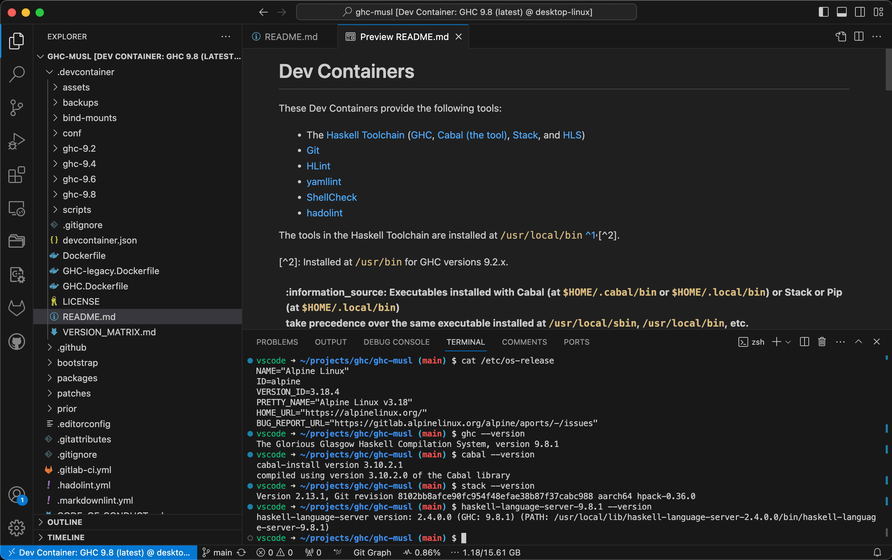
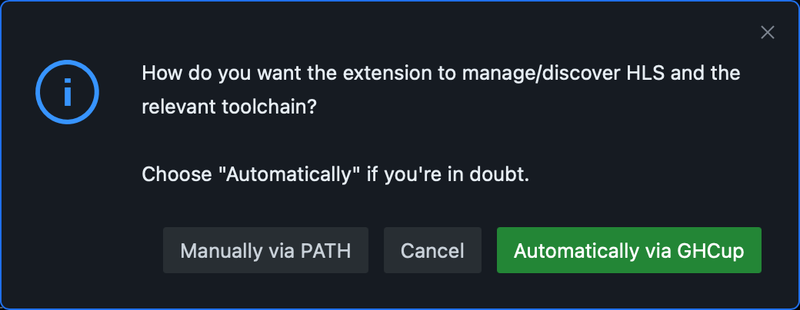

# Dev Containers

These Dev Containers provide the following tools:

* The
  [Haskell Toolchain](https://www.haskell.org/ghcup/install/#supported-tools)
  ([GHC](https://www.haskell.org/ghc),
  [Cabal (the tool)](https://cabal.readthedocs.io),
  [Stack](https://docs.haskellstack.org), and
  [HLS](https://haskell-language-server.readthedocs.io))
* [Git](https://git-scm.com)
* [HLint](https://hackage.haskell.org/package/hlint)
* [yamllint](https://yamllint.readthedocs.io)
* [ShellCheck](https://www.shellcheck.net)
* [hadolint](https://github.com/hadolint/hadolint)

The tools in the Haskell Toolchain are installed at `/usr/local/bin`
[^1],[^2].

[^1]: `PATH=$HOME/.cabal/bin:$HOME/.local/bin:/usr/local/sbin:/usr/local/bin:/usr/sbin:/usr/bin:/sbin:/bin`

[^2]: Some of them installed at `/usr/bin` for GHC versions < 9.2.8.

| :information_source: Executables installed with Cabal (at `$HOME/.cabal/bin` or `$HOME/.local/bin`) or Stack or Pip (at `$HOME/.local/bin`) take precedence over the same executable installed at `/usr/local/sbin`, `/usr/local/bin`, etc.|
|:----------------------------------------------------------------------------------------------------------------------------------------------------------------------------------------------------------------------------------------------|

[VS Code](https://code.visualstudio.com) is used as IDE, with the following
extensions pre‑installed:

* [.gitignore Generator](https://marketplace.visualstudio.com/items?itemName=piotrpalarz.vscode-gitignore-generator)
* [EditorConfig](https://marketplace.visualstudio.com/items?itemName=EditorConfig.EditorConfig)
* [GitHub Pull Requests and Issues](https://marketplace.visualstudio.com/items?itemName=GitHub.vscode-pull-request-github)
* [GitLab Workflow](https://marketplace.visualstudio.com/items?itemName=GitLab.gitlab-workflow)
* [GitLens — Git supercharged](https://marketplace.visualstudio.com/items?itemName=eamodio.gitlens)
  * Pinned to v11.7.0 due to unsolicited AI content in recent versions.
* [Git Graph](https://marketplace.visualstudio.com/items?itemName=mhutchie.git-graph)
* [hadolint](https://marketplace.visualstudio.com/items?itemName=exiasr.hadolint)
* [Haskell](https://marketplace.visualstudio.com/items?itemName=haskell.haskell)
* [markdownlint](https://marketplace.visualstudio.com/items?itemName=DavidAnson.vscode-markdownlint)
* [Path Intellisense](https://marketplace.visualstudio.com/items?itemName=christian-kohler.path-intellisense)
* [Project Manager](https://marketplace.visualstudio.com/items?itemName=alefragnani.project-manager)
* [Resource Monitor](https://marketplace.visualstudio.com/items?itemName=mutantdino.resourcemonitor)
* [ShellCheck](https://marketplace.visualstudio.com/items?itemName=timonwong.shellcheck)
* [YAML](https://marketplace.visualstudio.com/items?itemName=redhat.vscode-yaml)

## Parent images

The parent images are multi‑arch (`linux/amd64`, `linux/arm64/v8`)
<nobr>*GHC musl*</nobr> images. They are based on Alpine Linux (that is
[musl libc](https://musl.libc.org) and [BusyBox](https://www.busybox.net)).

They contain *unofficial* and *untested* binary distributions of GHC (that is,
ones not released by the GHC developers). That is because:

1. the official GHC binary distributions for Alpine Linux/x86_64 have
   [known](https://gitlab.haskell.org/ghc/ghc/-/issues/23043)
   [bugs](https://gitlab.haskell.org/ghc/ghc/-/issues/25093) ~~; and~~
1. ~~there are no official binary distributions for Alpine Linux/AArch64.~~

Stack's global configuration (`/etc/stack/config.yaml`) sets
<nobr>`system-ghc: true`</nobr> and <nobr>`install-ghc: false`</nobr>. That
ensures that only the GHC available in the Dev Containers is used.

## Usage

For local/remote usage with VS Code, please follow the instructions at
[Developing inside a Container](https://code.visualstudio.com/docs/devcontainers/containers).

For use with Github Codespaces, please follow the instruction at
[Creating a codespace for a repository](https://docs.github.com/en/codespaces/developing-in-codespaces/creating-a-codespace-for-a-repository#creating-a-codespace-for-a-repository).

### Versions

See the [Version Matrix](VERSION_MATRIX.md) for detailed information.

### Uniqueness

What makes these Dev Containers unique:

1. Default mount:
    * source: empty directory
    * target: `/home/vscode`
    * type: volume
1. Codespace only mount:
    * source: root of this repository
    * target: `/workspaces`
    * type: misc
1. Default path: `/home/vscode`
1. Default user: `vscode`
    * uid: 1000 (auto-assigned)
    * gid: 1000 (auto-assigned)
1. Lifecycle scripts:
    * [`onCreateCommand`](scripts/usr/local/bin/onCreateCommand.sh):
      home directory setup
    * [`postAttachCommand`](scripts/etc/skel/.local/bin/checkForUpdates.sh):
      Codespace only: Check for Dev Container updates

### Persistence

Data in the following locations is persisted:

1. The user's home directory (`/home/vscode`[^3])
1. The Dev Container's workspace (`/workspaces`)

[^3]: Alternatively for the root user (`/root`). Use with Docker/Podman in
*rootless mode*.

This is accomplished either via a *volume* or *bind mount* (or *loop device*
on Codespaces) and is preconfigured.

| :information_source: **Codespaces: A 'Full Rebuild Container' resets the home directory!** This is never necessary unless you want exactly that. |
|:----------------------------------------------------------------------------------------------------------------------------------------------------|

## Haskell Language Server (HLS)

Choose <nobr>`Manually via PATH`</nobr> when asked the following question:

## License

The code in this directory is not part of ghc-musl (the software) and, with the
exceptions noted in [LICENSE](LICENSE), is distributed under the terms of the
MIT License.
